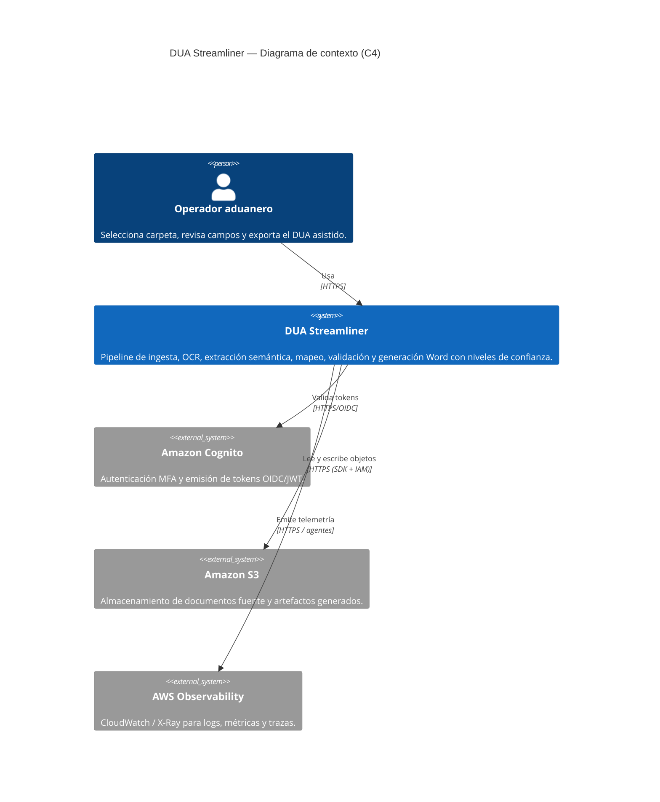
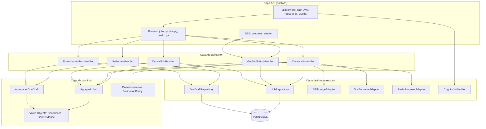
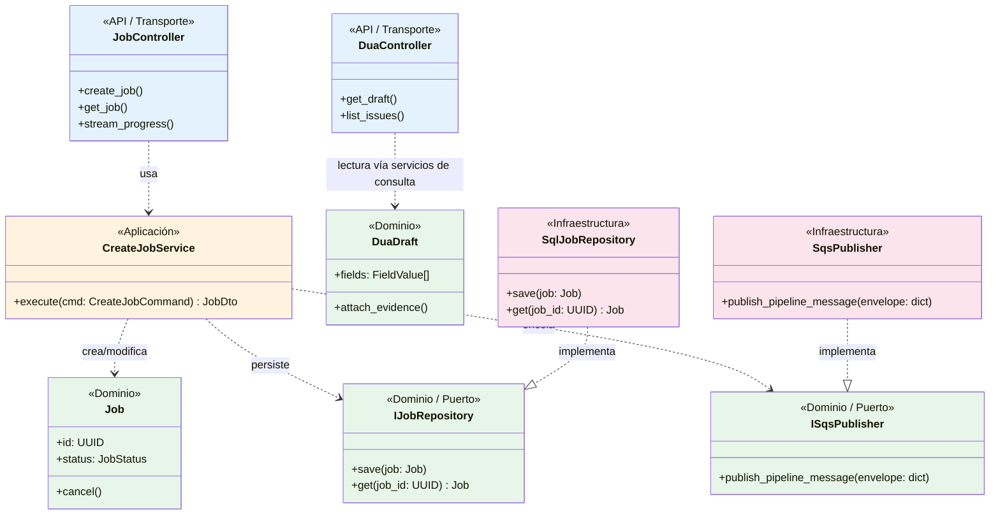

# DUA Streamliner
**Intelligent System for Automated Generation of the Single Customs Document (DUA)**  
**Course:** Software Design – Computer Engineering  
**Case #1 (15%)**

## Authors
- Guillermo Coto Álvarez
- Marlon Badilla Mora

**Problem:** Preparing the DUA requires interpreting many documents (commercial invoices, packing lists, bill of lading (BL), certificates, insurance policies, permits, etc.) that arrive in different formats (Word, Excel, PDF, and scanned images). Manual completion is slow, repetitive, and error-prone, and it heavily depends on the expertise of the customs agent or operator, which can lead to delays, rejections, or penalties.

**How:** DUA Streamliner takes a folder containing the files and runs an automated pipeline: it reads Word/Excel, extracts text and tables from PDFs, and applies OCR to scanned images. Then it performs semantic extraction to identify key customs data (values, currencies, incoterms, countries, transport info, invoice numbers/dates) and maps them to the official DUA fields, applying basic validations and flagging ambiguities with confidence levels.

**Results:** The system generates a pre-filled DUA Word document with visual confidence coding (green: high, yellow: medium, red: needs review) and a list of observations to quickly correct issues. This shifts the customs expert’s work from “filling everything manually” to “reviewing and adjusting,” reducing time, errors, and rework.

## Scope (MVP)
1. Folder path selection
2. Multi-format reading (docx/xlsx/pdf/img + OCR)
3. Semantic extraction of customs fields
4. Mapping and basic validation
5. Pre-filled DUA generation in Word with a traffic-light confidence indicator

## Key References
- DUA messaging/specification (Ministry of Finance): https://www.hacienda.go.cr/docs/Mensaje_TD_DUA-V3-17-12-03-2025.pdf
- Documents of interest (Ministry of Finance / DGA): https://www.hacienda.go.cr/DocumentosInteres.html
- User manual/guide related to DUA exports (VUCE): https://www.vuce.cr/wp-content/uploads/2021/10/Manual-de-Usuario-DUA-Exportaciones_compressed.pdf

## Repository structure (proposal)
- docs/
  - research/            # notes, links, comparison of similar solutions
  - architecture/        # diagrams, ADRs, decisions
- src/
  - frontend/
  - backend/
- tests/
- samples/               # anonymized or dummy examples

# 1. Frontend Design

## 1.1 Technology stack: frontend technology, security, third-party libraries, frameworks, hosting; all with their respective versions.
- Application type: web app
- Web framework: ReactJS version 19.2
- Node.js version 21
- Prettier 3.8.1
- TypeScript 5.8.3
- ESLint 10.0.2
- Unit testing: Jest 30.2.0
- Integration testing: Playwright version 1.58.2
- Cloud service: AWS cloud services
- Hosted by AWS App Services
- Code repositories in Github
- Automated code tasks with Husky 9.1.7
- CI/CD with Github DevOps Pipelines
- Environments: development, stage, and production
- Environments deployments: Azure DevOps Environments
- Observability with AWS Application Insights SDK / Gr

## 1.2 UX/UI analysis
### Core business process

#### Learnability
- First-time user completes “Select folder → Generate DUA” without help in ≤ 2 minutes.
#### Efficiency
- Returning user generates a DUA in ≤ 60 seconds (excluding heavy OCR processing).
#### Error prevention
- The system detects missing / duplicate / unreadable files and suggests an action (retry OCR, replace, ignore).
#### Status visibility
- The user always sees stage-based progress (Ingestion → OCR → Extraction → Mapping → Validation → Word).
#### Control and reversibility
- Edit a field and “undo / reset to AI suggestion”.
#### Traceability
- Each field shows “where it came from” (file + page + snippet).
#### Basic accessibility
- Contrast, keyboard navigation, clear text.
#### Confidence
- Traffic-light indicator (green/yellow/red) + a short explanation of why.

### Wireframes              (https://golden-wasp-02185792.figma.site)
Home / Folder selection  
Button: “Select folder”  
Detected files list with icons and type (PDF/DOCX/XLSX/IMG)  
Button: “Analyze”  


Processing / Progress  
Stage progress bar + percentage  
Short log (e.g., “OCR page 3/12…”)  
Buttons: “Cancel” / “Retry OCR” if something failed  


DUA Review (main screen)  
Left panel: “DUA Fields” grouped by sections  
Right panel: “Evidence” (document preview + highlighted source text)  
Each field: value + color (green/yellow/red) + confidence % + source


Issues / Validations  
List of issues (inconsistent currency, totals don’t match, invalid date)  
Quick actions: “Fix”, “Mark as reviewed”, “Ignore with reason”  


Export  
Button: “Generate Word (.docx)”  
Summary: # green / # yellow / # red  
Download + save job history  


**Testing results**

Test de mamá de Guillermo:


Test de hermana de Guillermo:


Test de amigo de Marlon:


## 1.3 Component design strategy
Defines the technique and principles for frontend component design: how component reuse is achieved, how styles are centralized, branding, internationalization, and responsiveness.

* Use atomic design for basic and complex component design
* Centralize one style per component
* Component-scope naming convention
* Use only "rem" positional units to support responsivenes in the design
* Components support react i-18next
* Accesibility is out of scope

## 1.4 Security (Technologies, techniques, and classes (with their location in the project structure) responsible for authentication and authorization of permissions and sessions.)

* Authentication method: Multifactor through AWS Cognito
* Authorization: AWS Cognito       
* Single sign on AWS Cognito
* Authentication handled through AWS Cognito
* Access method: RBAC
* Roles: ADMIN, USER_AGENT, SUPPORT, AUDIT
* Permissions by role:
*   * ADMIN:
*     + Permission code: MANAGE_USER
*     + Permission code: VIEW_REPORTS
*     + Permission code: EDIT_TEMPLATES
*     + Permission code: DOWNLOAD_DUA
*   * USER_AGENT:
*      + Permission code: LOAD_FILES
*      + Permission code: GENERATE_DUA
*      + Permission code: DOWNLOAD_DUA
*   * SUPPORT:
*      + Permission code: VIEW_ERROR_REPORTS
*      + Permission code: EDIT_TEMPLATES
*      + Permission code: LOAD_FILES
*      + Permission code: DOWNLOAD_DUA
*      + Permission code: GENERATE_DUA
*   * AUDIT:
*      + Permission code: VIEW_REPORTS
*      + Permission code: DOWNLOAD_DUA

*  AWS Secrets Manager is used to store Environment variables, API keys, Sensitive configuration data
*  Server name: customsidentityserver


## 1.5 Layered design
Design and explanation of the different layers of the frontend application.

Folder structure:
```text
/webapp
│
├── .github/
│   └── workflows/                # GitHub DevOps pipelines
│
├── public/
│   └── assets/                   # static assets
│
├── src/
│
│   ├── app/                      # application bootstrap & providers
│   │   ├── App.tsx
│   │   ├── routes.tsx
│   │   ├── store.ts
│   │   └── providers/
│   │       ├── AuthProvider.tsx
│   │       ├── I18nProvider.tsx
│   │       └── ThemeProvider.tsx
│
│   ├── domain/                   # business models & rules
│   │   ├── dua/
│   │   ├── user/
│   │   └── permissions/
│
│   ├── application/              # use cases / orchestration
│   │   ├── generateDUA/
│   │   ├── validation/
│   │   └── workflow/
│
│   ├── infrastructure/           # external integrations
│   │   ├── api/
│   │   │   └── httpClient.ts
│   │   ├── cognito/
│   │   │   ├── authService.ts
│   │   │   └── sessionManager.ts
│   │   ├── observability/
│   │   │   └── appInsights.ts
│   │   └── storage/
│
│   ├── presentation/
│   │
│   │   ├── components/           # Atomic design
│   │   │   ├── atoms/
│   │   │   ├── molecules/
│   │   │   ├── organisms/
│   │   │   └── templates/
│   │   │
│   │   ├── pages/
│   │   │   ├── Dashboard/
│   │   │   ├── GenerateDUA/
│   │   │   └── Reports/
│   │   │
│   │   ├── hooks/
│   │   ├── layouts/
│   │   └── styles/
│
│   ├── security/
│   │   ├── rbac/
│   │   │   ├── roles.ts
│   │   │   ├── permissions.ts
│   │   │   └── accessGuard.ts
│   │   └── auth/
│   │       └── tokenValidator.ts
│
│   ├── shared/
│   │   ├── constants/
│   │   ├── utils/
│   │   ├── types/
│   │   └── config/
│
│   ├── i18n/
│   │   ├── index.ts
│   │   └── locales/
│
│   └── main.tsx
│
├── tests/
│   ├── unit/                     # Jest
│   └── integration/              # Playwright
│
├── .husky/                       # git hooks
├── tsconfig.json
├── eslint.config.js
├── prettier.config.js
└── package.json
```

List of responsability layers:
* Presentation Layer
* Component Layer
* Application Layer
* Domain Layer
* Security Layer
* Infrastructure Layer
* Integration Layer
* State Management Layer
* Observability Layer
* Configuration Layer
* Shared/Common Layer

Execution Workflow:
* User accesses application URL (AWS App Services hosting)
* Application bootstrap initializes providers (Auth, i18n, Theme, Observability)
* Cognito session validation executed
* MFA authentication performed if session not valid
* JWT token retrieved and stored in secure session context
* RBAC role extracted from token claims
* Route guard validates permissions before page rendering
* Page loads Atomic components and layout templates
* User selects folder for processing
* Files uploaded through infrastructure API client
* Backend ingestion workflow triggered
* Frontend subscribes to workflow status updates
* UI updates stage-based progress:
  * Ingestion
  * OCR
  * Extraction
  * Mapping
  * Validation
  * Word generation
* Validation results mapped into domain models
* Traceability metadata displayed per field
* User edits fields with undo/reset capability
* Generate DUA action executed
* File download enabled based on RBAC permission
* Observability events sent to AWS Application Insights
* Session maintained via Cognito token refresh
* Logout clears session and cached state

Gaps detected:
1. State Management Strategy Missing
  No definition of:
    Redux / Zustand / React Query / Context boundaries.
2. API Communication Pattern Undefined
  Missing:
    * REST vs GraphQL
    * retry strategy
    * error normalization
    * request caching
3. Token Storage Strategy Not Defined
  Need clarification:
    * memory storage vs cookies
    * refresh token handling
    * XSS mitigation approach
4. Error Handling Layer Missing
  No definition for:
    * global error boundary
    * API error mapping
    * UX error consistency
5. Environment Configuration Strategy Missing
  Need definition of:
    * env variable injection
    * runtime config per environment
    * secrets retrieval strategy
6. Observability Scope Undefined
  You mention AWS Application Insights but not:
    * what events are tracked
    * performance metrics
    * user journey telemetry
7. Loading & Async Strategy Missing
  Your workflow implies long OCR processing but lacks:
    * polling vs websocket strategy
    * cancellation handling
    * optimistic UI rules
8. Permission Enforcement Location Not Explicit
  * RBAC defined but missing statement:
  * enforcement at route level
  * component level
  * API call level

The frontend performs Server-Side Rendering (SSR) using ReactJS executed within a Node.js runtime hosted on AWS App Runner.
If no authenticated session exists, the Security Layer invokes AWS Cognito authentication with Multi-Factor Authentication enabled.
Upon successful authentication:
  * Cognito issues JWT tokens.
  * User roles are extracted for RBAC authorization.
  * The requested visual resource is rendered through the Components Layer.

**Component Structure**
Components follow Atomic Design:
  * Atoms
  * Molecules
  * Organisms
  * Templates
  * Pages

A Hooks layer connects UI interactions with application Services.

**Services Layer**
Services implement application operations and workflows.
Services may access:
  * Utils Layer
  * ApiClients Layer
  * Settings Layer

**Settings Layer**
The Settings layer retrieves configuration securely from AWS Secrets Manager during server-side rendering.
Secrets include:
  * API keys
  * service endpoints
  * environment configuration

**ApiClients Layer**
ApiClients handle communication with external APIs.
  * Endpoints and credentials are read from Settings.
  * Requests and responses use shared Models.
  * All data is validated using the DataValidation layer.

**Shared Layers**
The following layers are accessible system-wide:
  * Models
  * Utils
  * State Management
  * Exception Handling

**Notification Service**
The NotificationService allows asynchronous processing through callback endpoints exposed via AWS API Gateway.
External systems notify processing completion through callbacks rather than polling.

**Logging and Observability**
System events are registered through the Logs layer and transmitted to:
  * AWS CloudWatch Logs
  * AWS Application Insights

**Deployment Pipeline**
Code is stored in GitHub repositories and deployed using GitHub DevOps pipelines across environments:
  * Development
  * Stage
  * Production
Deployment targets AWS App Runner services.
```text  
+----------------------+
|     User Browser     |
+----------+-----------+
           |
           v
+-----------------------------+
|        AWS App Runner       |
|     NodeJS + React SSR      |
+-------------+---------------+
              |
        Authentication
              |
        AWS Cognito (MFA)
              |
+-----------------------------+
|      Components Layer       |
|       Atomic Design UI      |
+-------------+---------------+
              |
            Hooks
              |
        Services Layer
              |
   +----------+-----------+
   |          |           |
 Utils   ApiClients   Settings
                         |
              AWS Secrets Manager
                         |
                   Secrets / Config

ApiClients → External APIs
External APIs → API Gateway → Notification Service

Shared:
Models | Validation | State | Exception Handling

Logs → CloudWatch → AWS Application Insights

CI/CD:
GitHub → Pipelines → Dev/Stage/Prod → App Runner
```

## 1.6 Design patterns
This section lists the object-oriented design patterns used in the frontend, including **where each pattern lives in the current project structure** (security, UI refresh, notifications, state storage, API calls, async operations, session invalidation, event-driven programming, and object creation). :contentReference[oaicite:1]{index=1}

### Pattern map (concern → pattern → classes/modules → location)

| Concern / Need | Pattern | Classes / Modules | Location (existing folders) | How it is used |
|---|---|---|---|---|
| Authentication integration (MFA, login, logout, refresh) | **Facade** | `authService` | `src/infrastructure/cognito/authService.ts` :contentReference[oaicite:2]{index=2} | Wraps Cognito calls behind a small API used by UI/providers. |
| Session lifecycle (valid, refreshing, expired) + session invalidation | **State** | `sessionManager` | `src/infrastructure/cognito/sessionManager.ts` :contentReference[oaicite:3]{index=3} | Centralizes token refresh / expiration rules and exposes a single session state to the app. |
| Route-level authorization (RBAC) before rendering pages | **Proxy (Guard)** | `accessGuard` | `src/security/rbac/accessGuard.ts` :contentReference[oaicite:4]{index=4} | Blocks navigation/render if the user role/permissions do not allow the route/action. |
| Token validation rules (signature/claims/expiration) | **Strategy** | `tokenValidator` | `src/security/auth/tokenValidator.ts` :contentReference[oaicite:5]{index=5} | Encapsulates validation logic so rules can evolve without touching UI code. |
| Permissions catalog (roles → permissions) | **Specification (Rules as data)** | `roles`, `permissions` | `src/security/rbac/roles.ts`, `src/security/rbac/permissions.ts` :contentReference[oaicite:6]{index=6} | Defines authorization rules and permission codes used by guards and UI. |
| Central HTTP calls to backend | **Facade** | `httpClient` | `src/infrastructure/api/httpClient.ts` :contentReference[oaicite:7]{index=7} | Single entrypoint for REST calls (GET/POST/etc.) used by application workflows. |
| Cross-cutting HTTP behaviors (auth header, retry, error mapping, logging) | **Decorator (Interceptor-style)** | `httpClient` internal wrappers (e.g., attach token, retry) | `src/infrastructure/api/httpClient.ts` :contentReference[oaicite:8]{index=8} | Adds behaviors without changing every call site; keeps API calls consistent. |
| App bootstrap + global concerns (auth, i18n, theme) | **Provider / Dependency Injection (composition)** | `AuthProvider`, `I18nProvider`, `ThemeProvider` | `src/app/providers/*` :contentReference[oaicite:9]{index=9} | Provides global services/context to all pages/components. |
| Global state storage (job, selected files, progress, issues) | **Redux/Flux-style Store** | `store` | `src/app/store.ts` :contentReference[oaicite:10]{index=10} | Single source of truth for UI state; reduces inconsistent local states. |
| Orchestrate the use case (select folder → analyze → poll/receive updates → review → export) | **Mediator (Use-case coordinator)** | `GenerateDUA` use case modules | `src/application/generateDUA/` :contentReference[oaicite:11]{index=11} | Keeps UI thin: pages trigger use cases; use cases call infrastructure and update state. |
| Long-running workflow status updates (UI refresh by stages) | **Observer (Pub/Sub)** | Workflow “status subscription” utilities + hooks | `src/application/workflow/` + `src/presentation/hooks/` :contentReference[oaicite:12]{index=12} | UI subscribes to job status events (polling or callback-driven) and re-renders progress screens. |
| Validation rules (currency mismatch, totals mismatch, invalid date) | **Strategy** | validation rule modules | `src/application/validation/` :contentReference[oaicite:13]{index=13} | Each rule is a strategy; a validator runs all strategies and produces an `Issues` list. |
| Domain modeling (DUA fields, extracted evidence, confidence) | **Value Objects / Domain Model** | DUA models | `src/domain/dua/` :contentReference[oaicite:14]{index=14} | Keeps “DUA Field + confidence + evidence source” consistent across UI and workflows. |
| UI actions as testable operations (Analyze, Cancel, Retry OCR, Generate Word) | **Command** | command modules for workflow actions | `src/application/workflow/` :contentReference[oaicite:15]{index=15} | Encapsulates each action so it can be tested without React rendering. |
| Observability (track events: start job, cancel, retry, download) | **Facade** | `appInsights` | `src/infrastructure/observability/appInsights.ts` :contentReference[oaicite:16]{index=16} | Centralized telemetry for key user journeys and system events. |
| Configuration and secrets access | **Facade** | config/settings utilities | `src/shared/config/` :contentReference[oaicite:17]{index=17} | Centralizes env/config reads; avoids scattered hardcoded constants. |

---
### Event-driven programming (notifications vs polling)
The system supports asynchronous completion updates (“Notification Service” callbacks) and can also fall back to polling. In the frontend this is represented as an **Observer subscription** in `src/application/workflow/` consumed by hooks in `src/presentation/hooks/`, which updates the UI stage-by-stage (Ingestion → OCR → Extraction → Mapping → Validation → Word). 

### Where patterns appear in the current architecture
- **Security Layer**: RBAC guard + token validation + Cognito session lifecycle. :contentReference[oaicite:19]{index=19}  
- **Infrastructure Layer**: HTTP client, Cognito integration, observability SDK. :contentReference[oaicite:20]{index=20}  
- **Application Layer**: use cases (Generate DUA), workflow orchestration, validation strategies. :contentReference[oaicite:21]{index=21}  
- **Presentation Layer**: pages/components use hooks that subscribe to workflow updates and read state from `store.ts`. :contentReference[oaicite:22]{index=22}

## 1.7 Scaffold
The complete scaffold

[`src/frontend/webapp/`](./src/frontend/webapp)

Structure overview:

| Layer | Path |
|---|---|
| App bootstrap & providers | [`src/app/`](./src/frontend/webapp/src/app) |
| Domain models | [`src/domain/`](./src/frontend/webapp/src/domain) |
| Application / use cases | [`src/application/`](./src/frontend/webapp/src/application) |
| Infrastructure | [`src/infrastructure/`](./src/frontend/webapp/src/infrastructure) |
| Presentation (UI) | [`src/presentation/`](./src/frontend/webapp/src/presentation) |
| Security (RBAC) | [`src/security/`](./src/frontend/webapp/src/security) |
| Shared utilities | [`src/shared/`](./src/frontend/webapp/src/shared) |
| i18n (EN/ES) | [`src/i18n/`](./src/frontend/webapp/src/i18n) |
| Unit tests (Jest) | [`tests/unit/`](./src/frontend/webapp/tests/unit) |
| Integration tests (Playwright) | [`tests/integration/`](./src/frontend/webapp/tests/integration) |
| CI/CD pipeline | [`.github/workflows/ci-cd.yml`](./src/frontend/webapp/.github/workflows/ci-cd.yml) |

---

# 2. Diseño del backend (DUA Streamliner)

Este apartado documenta el backend como **sistema**: transporte, contrato de API, paradigma de negocio, hosting, límites de dominio (DDD), seguridad, observabilidad, DevOps, disponibilidad, escalabilidad y vistas **C4** (contexto, contenedores, componentes y código).

## 2.1 Pila tecnológica

### 2.1.1 Protocolo de transporte y de aplicación

| Decisión | Elección (DUA Streamliner) | Justificación breve |
|----------|----------------------------|---------------------|
| Transporte | **TLS 1.2+ sobre TCP (HTTPS)**; terminación TLS en **Application Load Balancer (ALB)** con soporte **HTTP/2** | Exposición en Internet; compatibilidad con navegadores y clientes corporativos. |
| Estilo de API sobre HTTP | **REST** con contrato **OpenAPI 3.1** | Alineado con integraciones amplias, caching HTTP donde aplique y simplicidad operativa para el MVP. |
| Tiempo real (estado de jobs) | **SSE (Server-Sent Events)** como canal principal; **polling** como respaldo | Progreso por etapas (ingesta → OCR → extracción → mapeo → validación → Word) sin exigir WebSockets en todos los entornos. |
| Mensajería / eventos internos | **Amazon SQS** (colas estándar + DLQ) | Desacopla la API síncrona del trabajo pesado (OCR, extracción); absorbe picos y facilita reintentos. |

**Paradigma de la lógica de negocio**

- **Sincrónico (request/response)**: autenticación delegada (validación JWT), creación de jobs, consulta de metadatos, descarga de artefactos ya generados.
- **Asíncrono por colas/eventos**: pipeline de documentos (ingesta, OCR, extracción semántica, mapeo, validación, generación Word) ejecutado por **workers** consumiendo mensajes de SQS.
- **Batch** (fase posterior al MVP): reportes agregados, reconciliación y métricas de calidad fuera del camino online.

### 2.1.2 API service (capa de exposición)

- **Amazon API Gateway (HTTP API)** en el borde: enrutamiento, **throttling**, **CORS**, versionado por prefijo (`/v1`), documentación publicada desde OpenAPI.
- **AWS WAF** asociado al ALB/API Gateway para reglas básicas (rate-based, firmas comunes).
- No se define **BFF** separado en el MVP: el frontend SSR llama a un único **API Backend**; si en el futuro divergen fuerte web vs móvil, se evalúa BFF.

### 2.1.3 Hosting service (dónde corre el código)

| Artefacto | Modelo | Servicio AWS (referencia) |
|-------------|--------|---------------------------|
| API REST + SSE | **Contenedores gestionados** | **AWS ECS Fargate** (servicio `api`) detrás de ALB |
| Workers del pipeline | **Contenedores gestionados** | **AWS ECS Fargate** (servicio `worker`) escalado por profundidad de cola |
| Funciones auxiliares livianas (opcional) | **Serverless** | **AWS Lambda** solo si un paso encaja en límites de tiempo/tamaño (p. ej. transformaciones pequeñas) |

**Lenguaje y framework**

- **Python 3.12** + **FastAPI 0.115+** (API, validación con Pydantic, OpenAPI nativo).
- **Workers**: mismo repositorio, proceso distinto (`worker`) con consumidor SQS (biblioteca **boto3** / **aiobotocore** según diseño de I/O).

**Datos y almacenamiento**

- **Amazon RDS for PostgreSQL 16** (metadatos de jobs, campos DUA, trazabilidad fuente/página/snippet, issues).
- **Amazon S3** (objetos: uploads, artefactos intermedios opcionales, `.docx` generado).
- **Amazon ElastiCache for Redis** (estado efímero de progreso SSE, idempotencia corta, rate limiting suave — uso acotado al MVP).

## 2.2 Servicios, microservicios, repositorios y DDD

### 2.2.1 Decisiones explícitas

| Eje | Decisión |
|-----|----------|
| **Artefactos desplegables** | **Dos** en el MVP: `api` (FastAPI) y `worker` (pipeline asíncrono). Misma base de código, distinto punto de entrada y escala independiente. |
| **Repositorio** | **Monorepo** (el de este curso): `src/frontend/webapp` y `src/backend/` coexisten; CI con *path filters* para construir solo lo afectado. |
| **Microservicios** | No se fragmenta en microservicios numerosos en el MVP: **monolito modular** repartido en **dos procesos** (API + worker) por acoplamiento operativo y consistencia transaccional en PostgreSQL. |
| **Contratos** | **OpenAPI** (API pública); mensajes internos de cola con **JSON Schema** versionado (`schema_version` en el sobre del mensaje). |

### 2.2.2 Contextos delimitados (DDD)

| Bounded context | Responsabilidad | Notas |
|-----------------|-----------------|-------|
| **Identidad y acceso** | Validar **JWT** emitidos por **Amazon Cognito** (MFA del lado IdP); mapear claims a roles internos alineados con RBAC del frontend. | Sin “sesión server-side” obligatoria; API **stateless**. |
| **Orquestación de jobs** | Crear/cancelar jobs, estados, transiciones y publicación de eventos de progreso. | Orquestación **por aplicación** + colas; sin motor BPM pesado en MVP. |
| **Ingesta y almacenamiento** | Subida a S3, registro de archivos, detección de tipo y normalización de entrada. | Virus scan opcional (p. ej. ClamAV en worker) como mejora. |
| **OCR y extracción de texto** | PDF nativo vs escaneo; motores OCR; extracción tabular. | Aísla dependencias de proveedor/local. |
| **Extracción semántica y mapeo** | Entidades de dominio aduanero → campos DUA; confidence. | Corazón del dominio; reglas extensibles. |
| **Validación y observaciones** | Reglas de negocio (totales, monedas, fechas, coherencia entre documentos). | Produce lista de *issues*. |
| **Exportación DUA** | Generación **Word** desde plantilla y metadatos de revisión. | Salida en S3 + URL firmada. |

**Patrones tácticos (por contexto)**

- **Agregados** (ej. `Job`, `DuaDraft`) con invariantes claras.
- **Repositorios** por agregado en la capa de persistencia.
- **Servicios de dominio** donde la lógica no pertenece a una sola entidad.
- **Anticorruption layer** frente a SDKs de AWS y, si aplica, conectores externos.

## 2.3 Seguridad

| Tema | Decisión |
|------|----------|
| **Autenticación vs autorización** | **OAuth2/OIDC** vía **Cognito**; API valida **JWT** (firma, `aud`, `iss`, exp/leeway). **Autorización**: RBAC por *claims* / grupos, espejo de permisos del frontend (`ADMIN`, `USER_AGENT`, `SUPPORT`, `AUDIT`). |
| **Secretos** | Nunca en Git: **AWS Secrets Manager** (cadena BD, claves KMS opcionales) + **SSM Parameter Store** para no secretos versionables. |
| **Cifrado** | **TLS** en tránsito; en reposo **S3 SSE-KMS**, **RDS encryption**, **EBS** cifrado en Fargate. |
| **Superficie de API** | Validación estricta (Pydantic), límites de tamaño de payload, **rate limiting** en API Gateway; guía **OWASP API Top 10**. |
| **Red** | API y workers en **subredes privadas**; salida a Internet vía **NAT Gateway** donde sea necesario; **VPC endpoints** (S3, SQS, Secrets Manager) para no exponer tráfico a servicios AWS por ruta pública. |
| **Cumplimiento** | Retención de logs acotada; datos en **región** acordada; tratamiento de datos personales si los documentos los contienen (minimización en almacenamiento y trazas). |

## 2.4 Observabilidad

| Pilar | Qué instrumentar | Destino (AWS) |
|-------|------------------|----------------|
| **Logs** | JSON estructurado; `request_id`, `job_id`, `trace_id` en cada línea | **Amazon CloudWatch Logs** |
| **Métricas** | RPS, latencias p95/p99, errores 4xx/5xx, profundidad SQS, duración por etapa del pipeline | **CloudWatch Metrics** + dashboards |
| **Trazas** | **OpenTelemetry** en API y worker | **AWS X-Ray** (exportador) / correlación con logs |

**Patrones**: health checks **liveness/readiness** en Fargate; **correlation ID** propagado de API a mensajes SQS y worker; SLIs de partida: disponibilidad API, tiempo hasta primer progreso de job, tasa de fallos de OCR.

## 2.5 Infraestructura (DevOps)

- **IaC**: **Terraform** (VPC, RDS, S3, SQS, ECS, ALB, API Gateway, IAM mínimo privilegio).
- **CI/CD**: **GitHub Actions**; construcción de imágenes **OCI**, push a **Amazon ECR**, despliegue a ECS con estrategia **rolling**; camino hacia **blue/green** para la API si el negocio lo exige.
- **Entornos**: `dev`, `staging`, `prod` con paridad razonable; datos no productivos anonimizados o sintéticos.
- **Contenedores**: imágenes inmutables por digest; escaneo de vulnerabilidades en ECR; políticas de retención de imágenes.

## 2.6 Disponibilidad

- **Multi-AZ** para RDS en producción; backups automáticos y ventana de mantenimiento definida.
- **ALB** multi-AZ; objetivos de SLA internos más estrictos que los del proveedor solo donde tenga sentido de costo.
- **Resiliencia de dependencias**: **timeouts**, **retries con backoff** y **circuit breaker** hacia servicios externos (si se integran); DLQ en SQS para mensajes no procesables tras reintentos.
- **Degradación**: colas absorben picos; la API puede seguir aceptando jobs aunque el worker esté lento, hasta límites de tamaño de cola y políticas de *backpressure*.

## 2.7 Escalabilidad

- **Stateless** en la capa `api` (sin sesión en memoria del servidor).
- **Escalado horizontal** del `worker` según **ApproximateNumberOfMessagesVisible** en SQS y CPU si aplica.
- **Particionamiento**: clave natural por `job_id` en almacenamiento y mensajes; en fases futuras, evaluar partición de tablas por volumen.
- **Caching**: Redis para progreso y lecturas calientes de estado de job; **no** cachear respuestas mutables sin TTL estricto.
- **Límites de auto-scaling** máximos para control de costos.

## 2.8 Diseño C4

### 2.8.1 Diagrama de contexto

**Actores y sistemas externos**: el **operador aduanero** (persona) usa la aplicación web; el **sistema DUA Streamliner** orquesta la generación asistida del DUA; interactúa con **Amazon Cognito** (identidad), **Amazon S3** (documentos y resultados) y canales AWS de observabilidad. Referencias normativas (Hacienda/VUCE) permanecen como **fuentes de verdad del negocio** consultadas por humanos; integraciones electrónicas oficiales quedan fuera del MVP salvo decisión explícita posterior.



### 2.8.2 Diagrama de contenedores

**Contenedores lógicos**: SPA/SSR (existente en el entregable frontend), **API Backend** (FastAPI) detrás de **API Gateway + ALB**, **Worker** (consumidor SQS), **PostgreSQL (RDS)**, **Redis (ElastiCache)**, **S3**, **SQS**. Flujo principal: el cliente crea un `job` por HTTPS; la API publica mensajes; el worker avanza etapas y persiste estado; el cliente recibe progreso por **SSE** y obtiene descarga vía URL firmada o endpoint de descarga autenticado.

```mermaid
C4Container
title DUA Streamliner — Diagrama de contenedores (C4)

Person(operador, "Operador aduanero", "Usuario del sistema")
System_Boundary(sys, "DUA Streamliner") {
    Container(web, "Aplicación web (SSR)", "Node.js 21 + React 19", "Interfaz, autenticación con Cognito, orquestación UX del flujo.")
    Container(api, "API Backend", "Python 3.12 + FastAPI", "REST + OpenAPI; SSE de progreso; control de jobs y permisos.")
    Container(worker, "Worker pipeline", "Python 3.12", "OCR, extracción, mapeo, validación, generación Word; consume SQS.")
    ContainerDb(db, "Base de datos", "PostgreSQL 16 (RDS)", "Jobs, borradores DUA, trazabilidad e issues.")
    ContainerQueue(q, "Cola de trabajos", "Amazon SQS", "Desacoplamiento y reintentos con DLQ.")
    ContainerCache(cache, "Caché / estado efímero", "Redis (ElastiCache)", "Progreso SSE, deduplicación corta.")
    ContainerStore(store, "Object storage", "Amazon S3", "Archivos subidos y salida .docx.")
}

System_Ext(cognito, "Amazon Cognito", "IdP OIDC")
System_Ext(apigw, "Amazon API Gateway", "Borde HTTP: throttling, CORS, routing")
System_Ext(alb, "Application Load Balancer", "TLS + HTTP/2 hacia ECS Fargate")

Rel(operador, web, "Usa", "HTTPS")
Rel(web, cognito, "Login/MFA", "HTTPS/OIDC")
Rel(web, apigw, "API JSON + SSE", "HTTPS")
Rel(apigw, alb, "Integración", "HTTPS")
Rel(alb, api, "Forward", "HTTPS")
Rel(api, db, "Lee/escribe metadatos", "TCP/TLS")
Rel(api, q, "Publica mensajes de pipeline", "HTTPS (SDK)")
Rel(api, store, "URLs firmadas / SDK", "HTTPS")
Rel(api, cache, "Estado de progreso", "TCP/TLS")
Rel(worker, q, "Consume", "HTTPS (SDK)")
Rel(worker, db, "Persistencia", "TCP/TLS")
Rel(worker, store, "Lee/Escribe objetos", "HTTPS (SDK)")
Rel(worker, cache, "Actualiza progreso", "TCP/TLS")
```

### 2.8.3 Diagrama de componentes (contenedor API)

**Componentes** agrupados por capas: **API (transporte)**, **Aplicación (casos de uso)**, **Dominio**, **Infraestructura**. Las flechas muestran dependencia en tiempo de ejecución típica (de borde hacia dominio).



**Componentes del worker (resumen)**

- `PipelineDispatcher`: enruta mensaje a etapa (ingestión, OCR, extracción, mapeo, validación, export).
- `OcrService`, `ExtractionService`, `MappingService`, `WordExportService`: aplicación + adaptadores.
- `JobRepository`, `S3StorageAdapter`, cola y notificaciones de progreso comparten contratos de dominio con la API donde tiene sentido (DTO internos versionados).

### 2.8.4 Diagrama de código (UML — organización y clases clave)

**Objetivo**: mostrar jerarquía de clases/módulos y **patrones** (repositorio, adaptador, servicio de aplicación), no el detalle de cada método. Los colores indican **capa**.



**Organización de carpetas propuesta (`src/backend`) — código fuente**

```text
src/backend/
├── api/
│   ├── main.py                 # FastAPI app, lifespan, routers
│   ├── deps.py                 # Inyección de dependencias (repos, clients)
│   ├── middleware/
│   │   ├── request_context.py  # request_id / trace
│   │   └── security.py         # JWT Cognito
│   └── routers/
│       ├── health.py
│       ├── jobs.py
│       └── dua.py
├── application/
│   ├── commands/
│   │   └── create_job.py
│   ├── queries/
│   │   └── get_job_status.py
│   └── services/
│       └── create_job_service.py
├── domain/
│   ├── jobs/
│   │   ├── job.py
│   │   └── repositories.py   # interfaces (ports)
│   ├── dua/
│   │   ├── dua_draft.py
│   │   └── value_objects.py
│   └── common/
│       └── ids.py
├── infrastructure/
│   ├── persistence/
│   │   ├── models/             # SQLAlchemy models (opcional)
│   │   └── sql_job_repository.py
│   ├── messaging/
│   │   └── sqs_publisher.py
│   ├── storage/
│   │   └── s3_adapter.py
│   └── cache/
│       └── redis_progress.py
├── worker/
│   ├── main.py                 # entrypoint consumer SQS
│   └── handlers/
│       ├── ingest_handler.py
│       ├── ocr_handler.py
│       ├── extract_handler.py
│       ├── map_handler.py
│       ├── validate_handler.py
│       └── export_word_handler.py
├── contracts/
│   └── openapi.yaml            # fuente o artefacto generado del contrato
├── tests/
│   ├── unit/
│   └── integration/
├── Dockerfile.api
├── Dockerfile.worker
└── pyproject.toml
```

**Fragmento de código ilustrativo (FastAPI + servicio de aplicación)**

```python
# src/backend/api/routers/jobs.py
from fastapi import APIRouter, Depends, status
from uuid import UUID

from api.deps import get_create_job_service, get_current_user
from application.services.create_job_service import CreateJobService
from application.commands.create_job import CreateJobCommand

router = APIRouter(prefix="/v1/jobs", tags=["jobs"])


@router.post("", status_code=status.HTTP_201_CREATED)
def create_job(
    cmd: CreateJobCommand,
    svc: CreateJobService = Depends(get_create_job_service),
    user=Depends(get_current_user),
):
    return svc.execute(cmd, user_id=user.sub).model_dump()


@router.get("/{job_id}")
def get_job(job_id: UUID, svc: CreateJobService = Depends(get_create_job_service), user=Depends(get_current_user)):
    return svc.get(job_id, user_id=user.sub).model_dump()
```

```python
# src/backend/application/services/create_job_service.py
from dataclasses import dataclass
from uuid import UUID, uuid4

from domain.jobs.job import Job, JobStatus
from domain.jobs.repositories import IJobRepository
from domain.common.ids import UserId
from infrastructure.messaging.sqs_publisher import ISqsPublisher


@dataclass
class CreateJobService:
    jobs: IJobRepository
    bus: ISqsPublisher

    def execute(self, cmd, user_id: str):
        uid = UserId(user_id)
        job = Job.create(id=uuid4(), owner=uid, s3_prefix=cmd.s3_prefix)
        self.jobs.save(job)
        self.bus.publish_pipeline_message(
            {"schema_version": 1, "type": "PIPELINE_START", "job_id": str(job.id)}
        )
        return job.to_dto()

    def get(self, job_id: UUID, user_id: str):
        job = self.jobs.get(job_id)
        job.ensure_owned_by(UserId(user_id))
        return job.to_dto()
```

---
